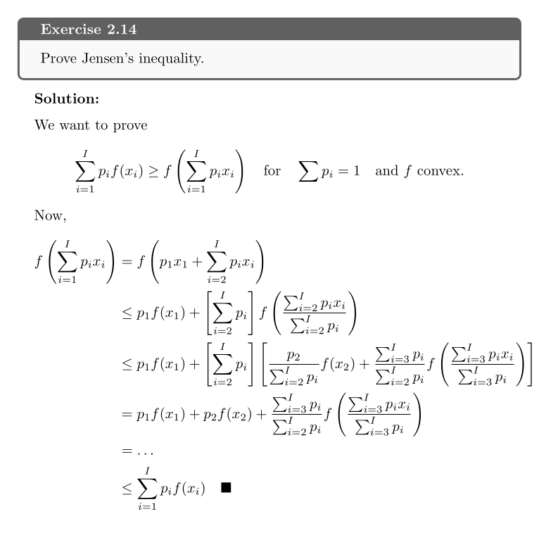

# Information Theory, Pattern Recognition and Neural Networks
This repo contains LaTeX write-ups for exercises from David MacKay's "Information Theory, Pattern Recognition and Neural Networks". To give a quick visual taste of the styling, here's Exercise 2.14 rendered straight from the source:

